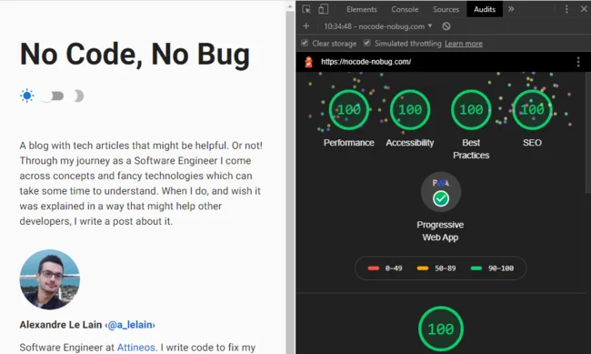

It's time to unleash the real power of your website! Time has come to make it **fast**, **accessible**, **reliable** and **standardized** for search engines.

I will try my best to give you the guidelines in order to achieve this through this article.

If you already are familiar with [lighthouse](https://developers.google.com/web/tools/lighthouse), you may be auditing [nocode-nobug.com](https://nocode-nobug.com) at the moment you're reading this to see how legitimate I am to write about a potential perfect score on this audit.

Please, be my guest. I would most probably do the same thing. I have been working a lot to optimize [nocode-nobug.com](https://nocode-nobug.com) and I can tell it was a lot of fun. 🙂

> You will notice that the audit's results may vary a little in function of the settings you tuned the lighthouse tool with.

If you are not yet familiar with `lighthouse`, don't worry, I'll present this awesome tool in the first part of the article.

**Disclaimer**: I do not pretend, in any way, to be in possesion of the unique truth that will guarantee you a perfect score on your website. [nocode-nobug.com](https://nocode-nobug.com) reaches the perfect score on the [Lightouse's Chrome DevTool - v5](https://developers.google.com/web/tools/lighthouse#devtools) with its **default preset**, but this score **may vary a little** depending on your internet connection and extensions you have installed, as well as the presets you can manually set.

Also, in some situations, I would recommand **not to blindly chase the perfect score.** There might be UI choices that lower the score but are vital to your website's soul - such as a particular styleguide, effect, and so on.

That said, I believe we should get **as close as we can** to a perfect audit score, but it should **not** impact the way you want your website **to feel** to your visitors.

**tl;dr**: If you want to see directly the exhaustive list of steps I'm recommanding to reach the perfect audit score, you can go directly to [this part](#tl;dr).

## Lighthouse

[Lighthouse](https://developers.google.com/web/tools/lighthouse) is a fabulous free and open-source tool from **Google**. Don't hesitate to check out the [github project](https://github.com/GoogleChrome/lighthouse), it's maintained actively.

It aims to imrove the global quality of the web pages - it is used as an audit tooling.

The audit comes with **5** main categories:

- [Performance](https://developers.google.com/web/tools/lighthouse/v3/scoring#perf): it measures the global performance of your page. The main metrics are the _First Meaningful & Contentful Paints_, the _Time To Interactive_ and the _Speed Index_. In brief, it audits how **fast** the page is.
- [Accessibility](https://developers.google.com/web/tools/lighthouse/v3/scoring#a11y): it measures how **accessible** your page is. It performs various checks on the page's elements, like the _colors contrast_, the _aria-x_ attributes and many more. The audit has to pass an exhaustive list defined in [this document](https://web.dev/lighthouse-accessibility/).
- [Best Practices](https://developers.google.com/web/tools/lighthouse/v3/scoring#best-practices): it measure how much the best practices encouraged by the [W3C](https://www.w3.org/) or [Google's standards](https://web.dev/lighthouse-best-practices/) are respected. For example, it will check if your page is served via _HTTPS_ or if errors are logged in the console. In brief, it stands for the **reliability** of your page.
- [SEO](https://web.dev/lighthouse-seo/): it measures how optimized and **standardized** your page is for search engines. It checks, for example, if the _document_ contains _meta tags_ and _semantic titles_.
- [Progressive Web App (PWA)](https://developers.google.com/web/tools/lighthouse/v3/scoring#pwa): it measures if your website is able to be installable and usable by all users. It has to pass the audit basedon the [Baseline PWA Checklist](https://web.dev/pwa-checklist/#baseline). For example, one of the required items is the full responsiveness of your pages.

Except for the **PWA** audit in the latest versions of the tool, they all are rated from **0** to **100**.

A score of **0** most likely indicates a problem with the lighthouse tool itself...or you either have a long way to go 😅

A score of **100** indicates that all the required checks for the category audited have passed. Congratulations! 😁

According to [Google](https://developers.google.com/web/tools/lighthouse/v3/scoring#perf), a score of **100** will rank your website in the top `5%` of performing sites, while a score of **50** will rank your website in the `75%` average ones.

The **PWA**'s audit score is a little bit different in _v5_: you don't get a score like the others, you have an exhaustive list of **14** checks to pass in order to reach the perfect score: [check-list](https://developers.google.com/web/tools/lighthouse).

## How to audit your site

You can run a `lighthouse` audit on a page using [Chrome DevTool](https://developers.google.com/web/tools/lighthouse#devtools), the [CLI](https://github.com/GoogleChrome/lighthouse-ci) or the [Node API](https://github.com/GoogleChrome/lighthouse).

If you want an easy & quick way to audit your site right-away with 0 configuration, go for the Chrome DevTool.

Here's the audit of [nocode-nobug.com](https://nocode-nobug.com):



## How to reach the best score

Finally getting there. The non-boring part begins.


### Performance

As said in the presentation of `lighthouse`, the main metric of the **Performance** is the **speed**. Your objective here is to make your website as **Fast** as you can.

> **Note**: There are many ways to optimize the speed of your page, I'll only go through the main ones in this section.

#### Images

This point is **important**. It's one of the best source of optimization you can bring to your website.

**First**, images should be sized as closed as possible to their final display-size on your page. For example, if you have a `biography` section on your page, the profile picture you will display will probably have small dimensions on the page. Say `96px * 96px` for instance. Then if the image you load has a dimension of `1280px * 1280px`, you will lose performance:

- Fetching a **1280px** image is way longer than a **96px** one
- Your broswer will do an extra calculation to re-size the image properly.

That said, be sure to size as close as possible your images to their final display.

> **Note**: the [srcset attribute](https://developer.mozilla.org/en-US/docs/Learn/HTML/Multimedia_and_embedding/Responsive_images) may help you handle responsive images.

**Second point**: [lazy-loading](https://developers.google.com/web/fundamentals/performance/lazy-loading-guidance/images-and-video). This technique will allow you to drastically improve the speed of your pages. To sum it up, this is what the `lazy-loading` does with your image:

- On browser's load, only a very **low-dimensioned** and blured version of your image is fetched and rendered.
- When the image on the page is in the viewport of your current scroll, the **original-dimensioned** one is fetched and rendered.

This technique allows to defer offscreen images. This is impacting drastically the pages with lots of images, since only the _placeholder_ images (those with very low dimensions) will be fetched when the page is loaded.

You can implement it yourself using [event-handlers](https://developers.google.com/web/fundamentals/performance/lazy-loading-guidance/images-and-video#using_event_handlers_the_most_compatible_way) or the [Intersection Observer API](https://developers.google.com/web/fundamentals/performance/lazy-loading-guidance/images-and-video#using_intersection_observer).

Some frameworks like [Gatsby.js](https://www.gatsbyjs.org/) (React) wrap this implementation in a layer or a plugin so you don't have to implement it yourself. [gatsby-image](https://www.gatsbyjs.org/packages/gatsby-image/) does it for you for example.

**Last, but not least:** use [next-gen](https://developers.google.com/web/tools/lighthouse/audits/webp) formats. For instance, the **WebP** (.webp) format is really under-estimated. In comparison to traditional _png_ or _jpg_ files, they are up to [25-34% smaller](https://developers.google.com/speed/webp), which is a huge gain.

The only drawback is its [browser support](https://caniuse.com/#feat=webp): not supported in **IE** (who cares?😉) neither in **Safari**.

#### DOM

Your **DOM** shouldn't have a too big size. The deepest and the biggest the DOM is, the more time it takes to the broswer to parse it and do actions on it.

There are multiple good practices to avoid this, for example try not to create `<div>` elements simply to add styling rules. Apply those styles on your functional elements instead and change their `display` mode if needs be.

Also, if you can, try to avoid accessing **DOM** elements in JS. It's very slow as stated in the [w3schools](https://www.w3schools.com/js/js_performance.asp) docs.

A word on [browser's painting](https://aerotwist.com/blog/pixels-are-expensive/): it is a very expensive calculation. Whatever framework you're working with (React, Angluar, Vue, etc...), make sure to limit the best you can the number of times your components render. The less they do, the less the browser has to paint the new DOM, and so the **fastest** your page will be.

#### CSS

Consider defering the load of non-essential stylesheets. For example, if you are using **CDNs** like the famous [Google's Roboto](https://fonts.google.com/specimen/Roboto) one, depending on how customize you want it, the stylesheet's size can jump quite quickly.

The most native approach is to add it in the `<head>` of your document like that:

```html
<link href="https://fonts.googleapis.com/css?family=Roboto&display=swap" rel="stylesheet" />
```

No surprise here. However, this approach has a drawback: this stylesheet will be loaded **synchronously**. Its fetching will block the main UI thread. **But** there is a solution. You can load the stylesheet **asynchronously** with this following (_very big quotes_) [hack](https://www.filamentgroup.com/lab/load-css-simpler/):

```html
<link
  rel="stylesheet"
  href="https://fonts.googleapis.com/css?family=Roboto:300,400,500,700&display=swap"
  media="print"
  onLoad="this.media='all'"
/>
```

Is that **magic** ? Not quite so. In fact, it is quite simple: when the browser sees that the `media` [attribute](https://www.w3schools.com/tags/att_link_media.asp) is not the default `'all'`, it will **not** block the paint of the page and it will **not** wait for the stylesheet to load. Thus, the page will be paint while the stylesheet is being fetched. Once it is, the `onLoad` attribute will be triggered, and thus the `style` will be applied to the page thanks to the `this.media='all'` JS function.

I didn't mention it, but of course make sure to use **minified** assets on the _production_ site.

#### Data

If you have to display and/or handle lots of data on a single page (tables, for example), you should implement techniques like **virtualization** to load and display only small chunks of actual **visible** data.

Depending on the web framework you are using, there are **tons of ways** to achieve this.

> If you are using React, I really recommand this awesome library: https://github.com/bvaughn/react-window.

#### Caching, Serving and Web Workers

An efficient **caching** and **assets serving** policy can also make a huge difference. Make the first visit on your website **fast**. Make the next ones **instant**.

If you are handling the server part, then this is totally up to you. If you simply have a single page application, let hosting providers like [Netlify](https://www.netlify.com/) handle all this stuff. They have a dedicated team on this.

You can also take advantage of the [Web Workers](https://developer.mozilla.org/en-US/docs/Web/API/Web_Workers_API) to run expensive client-side operations on a background thread, so you do not block the main UI thread.

### Accessibility

No magic or "hacks" here. To get the maximum score on the **Accessibility** audit, you just need to follow the exhaustive list of requirements from [web.dev/lighthouse-accessibility](https://web.dev/lighthouse-accessibility/).

I will try to sum up the main ones here:

First, your documents should have `<heading>` elements for your titles. A page should have [only one](https://developer.mozilla.org/en-US/docs/Web/HTML/Element/Heading_Elements) main title `<h1>`, but you can use as many `<h2>` as you want for your sections and anchors, as well as the other `h3-h6` headings.

Overall, your **DOM** should have the most semantics possible - use an `<article>` instead of a `<div>` to wrap a blog entry or a post for instance. All these little additions will help [screen readers](https://axesslab.com/what-is-a-screen-reader/) to understand better your document.

Secondly, always use `aria-x` attributes when possible, especially on elements that do not contain text. For example, the `BackToTop` button of **nocode-nobug.com** has an `aria-label` attribute to help screen-readers understand its purpose since it only contains an icon with no text. Also, your `<images>` should all have an `alt` attribute to describe them with text.

Your `<input>` elements should all have a `<label>` element coupled to them.

The background-color of your page should have enough contrast with the foreground-colors of the elements:

- Text with a font-size of _14px_ to _18px_ and _bold_ needs a contrast ratio of **3:1**
- Else, othe texts need a ratio of **4.5:1**

You can can read more about this rule on this [w3c page](https://www.w3.org/TR/WCAG21/#contrast-minimum).

Your `links` should have a meaningful text content to [improve](https://web.dev/link-name/) the navigation experience of your users and help the screen-readers.

**Bad**:

```html
You can check it out <a href="https://nocode-nobug.com">here</a>.
<!-- What's "here" ? -->
```

**Good**:

```html
You can check it out on the <a href="https://nocode-nobug.com">nocode-nobug home page</a>.
<!-- Oh okay. "here" is the home page from nocode-nobug. -->
```

There are of courses more guidelines to follow, and you can check them all out on the following website: [web.dev/lighthouse-accessibility](https://web.dev/lighthouse-accessibility/)

### Best Practices

This category doesn't have a lot of audit points, and a few of them can be solved in the same time as the **Performance** category.

Your website should use `HTTPS` protocol to encrypt the network requests. It has many benefits, and the main one is to hide the content of the communications to the listeners of the network.

Secondly, it should use its version 2: `HTTP/2`. It brings a lot of [performance increases](https://en.wikipedia.org/wiki/HTTP/2#Differences_from_HTTP_1.1) since it enables the multiplexing of the requests and the responses.

Also, note that the use of `document.write()` should be completely avoided since it [highly increases](https://web.dev/no-document-write/?utm_source=lighthouse&utm_medium=devtools) the display of the page's content. All your links pointing to an **external destination** should have the `rel="noopener"` or `rel="noreferrer"` to prevent the destination page to have access to the `window.opener` property and hijack the redirection.

Of course, your JavaScript bundle **shouldn't throw any errors** in the console: it usually indicates a feature doesn't work like it was designed to.


> The previous points are the main important ones from my humble point of view, but you can find the exhaustive list of points audited on the [official page](https://web.dev/lighthouse-best-practices/).

### SEO

**SEO**, or Search Engine Optimization, is an essential feature of your website if you want to optimize your ranking in the search engines (Google, Bing, etc...).

This is a crucial point to help robots and indexers **understand** your website the way **you want them to**.

Not only can you optimize the ranking, you can also customize and optimize the preview of your pages in the social medias and search engines.

Some audit points of this category are similar to those from the previous ones. However here are the **main points** you have to make sure you are following:

Your page should have a `<title>` element in its `<head>`. The page should have at least one `<meta>` tag: the `<meta name="description">` one. This element is directly linked to the [summary](https://web.dev/meta-description/) used by the search engines for your page's content.

Just like for the **Accessibility** audit, your links should have a descriptive text content.

Your [robots.txt](https://web.dev/robots-txt/) file should be valid, as well as the HTTP status code of the requests. If your page receive `400s` & `500s` errors, you will make robots flee your website ✈️.

Also, making your website [mobile-friendly](https://web.dev/viewport/) will help search engines to rank it better - Google has enabled the [mobile-first indexing](https://developers.google.com/search/mobile-sites/mobile-first-indexing) by default since July 2019.

> Here's the full list of the SEO audits: https://web.dev/lighthouse-seo/.

#### Bonus: make your website a golden mine for social media' graphs

Previously I mentionned you could optimize your page's meta-data to customize its preview and help social medias like Facebook or Twitter understand your page better.

This is **not a required step** to pass the audit successfully. However it brings **many advantages** compared to the little work it requires.

First things first, your `meta-tags` should follow the [Open Graph Protocol](https://ogp.me/) standard, which is itself built on [RDFa](https://en.wikipedia.org/wiki/RDFa), a W3C standard. This standard allows any social media application to understand your pages as rich objects.

The minimum configuration to take advantage of this standard is to use the **4** following properties:

- `og:title` - the title of your ressource (the page in our case). It can be any string.
- `og:type` - the [type](https://ogp.me/#types) of the ressource. It has to be one of the explicit values of the property.
- `og:url` - the url of the ressource.
- `og:image` - an image to represent the ressource.

Here is an example for an _cooking-article_ on a blog:

```html
<meta property="og:title" content="Cooking pasta like a chief" />
<meta property="og:type" content="article" />
<meta property="og:url" content="https://cooking-blog.com/cooking-pasta-like-a-chief" />
<meta property="og:image" content="https://cooking-blog.com/pasta.webp" />
```

This is just a _very small_ example of what the **OGP** has to offer. You can of course check out their documentation to make your page even richer in meta-informations!

**Twitter** has built their [own meta properties](https://developer.twitter.com/en/docs/tweets/optimize-with-cards/guides/getting-started) you can also add to your pages. This will generate a customized preview of your page on some social medias and tools. Their system work with different types of `Cards`. [nocode-nobug](/) is using their `meta-properties` - which creates the following preview:


Here's a sample of the markup that creates this preview:

```html
<meta name="twitter:card" content="summary" />
<meta name="twitter:creator" content="Alexandre Le Lain" />
<meta name="twitter:image" content="https://nocode-nobug.com/icons/icon-512x512.png" />
<meta name="twitter:title" content="What is hidden behind React's refs ?" />
<meta
  name="twitter:description"
  content="Learn what a React ref is, how to use React.forwardRef properly and how to share a local ref and forward it to another component."
/>
```

You can find out the exhaustive list of `meta-properties` on their [official documenation](https://developer.twitter.com/en/docs/tweets/optimize-with-cards/guides/getting-started).

### PWA

The **Progressive Web Apps** is a very interesting feature for a website: among other things, it will enable your users to have a full fledge-experience offline on your website.

For example, this feature is a **must-have** for any blog/documentation website which usually contain lots of text. Allowing your users to read your content **offline** and/or deliver content to users of **very slow bandwidth** connections (2G 🐌) is a great plus - and you can check this out on the [PWA Stats site](https://www.pwastats.com/).

A very **important advantage** of the PWA is to allow the visitors to use the browser of their choosing once your app is installed on their device. This is **awesome**. It litteraly means that with the trio `html`, `css` & `JavaScript` you can target almost **any** mobile users. No need to worry about the different native systems anymore.


Most of the modern browsers will be able to automatically install & deliver your website as a PWA to your users if you follow a strict exhaustive list of requirements:

First of all, the page load should be **fast enough** on most mobile networks. This should be solved in the **Performance** category. Limit the page load by fetching only the critical ressources (the text content for example) and deffer the loading of the rest (images, fonts, etc).

Secondly, your page should respond with a **200** status when **offline**. This can be achieved using [Service Workers](https://developer.mozilla.org/en-US/docs/Web/Progressive_web_apps/Offline_Service_workers). Their aim is to download the page' assets during the first visit of a visitor and store them locally - so that the next visit can be done offline.

Your page should also have a `manifest.webmanifest` file served directly at the root of your website (like the `sitemap.xml` for example). This manifest file allows you to **customize** the installation of your website on the user's device. Among other things, you can set up a `theme`, a `name` (usually the name displayed under the app's icon on the mobile) and your app's `icon` in different sizes. You will find the full configuration here: [web.dev/add-manifest](https://web.dev/add-manifest/).

The `document` of your page should also display some content if `JavaScript` is blocked on the client. Yes, this happens. And it can, for [good reasons](https://softwareengineering.stackexchange.com/questions/26179/why-do-people-disable-javascript).

I will not go through all of the requirements here, since this article is already getting too long. I wouldn't want you to get caught by your boss if you're reading this at work 😉. But you can check the full list on the [pwa-checklist page](https://web.dev/pwa-checklist/). You can also build easily the manifest on [pwabuilder.com](https://www.pwabuilder.com/).

> **Note**: many frameworks come with a built-in PWA configuration. If you are in the React eco-system, you can check out [create-react-app](https://github.com/facebook/create-react-app) or [gatsby.js](https://www.gatsbyjs.org/).

## Bonus: use it in your CI

**Lighthouse**'s team came up with a tool to integrate the audit in your CI: [github.com/GoogleChrome/lighthouse-ci](https://github.com/GoogleChrome/lighthouse-ci).

I haven't integrated it yet in the CI of **nocode-nobug.com**, but if I do, I will update this article to give you some feedback about it.

## TL;DR

Finally the part you were looking for! I tried to sum up the main steps that can be taken to reach the perfect audit score:

**Performances**

- Size correctly your images
- Use next-gen formats for images (like `webp`)
- Lazy-loading
- Defer fetching of non-essential ressources
- Keep your DOM small and simple

**Accessibility**

- Use headings
- Use semantic tags in your DOM
- Use `aria-x` attributes, especially `aria-label`
- Have enough color contrast ratio between text and background
- Use labels for your inputs
- Use meaningful text content for your links

**Best Practice**

- Use HTTPS
- Use HTTP/2
- Do not use `document.write`
- Use `rel="noopener"` or `rel="noreferrer"` attributes for external links
- Make sure your bundle doesn't throw errors in the console

**SEO**

- Have a `<title>` in the `<head>` of your document
- `<meta name="description">` is the strict-minimum to describe your page to search engines
- `robots.txt` & HTTP requests should be valid
- Make your website mobile-friendly
- Bonus: use OpenGraphProtocol & Twitter `<meta>` properties

**PWA**

- Page load should be fast. Display `text` first, load `images` and `styles` after
- Use `Service Workers` to make your website available offline
- Add a `manifest.webanifest` file to your website
- Display content even if `JavaScript` is blocked.
- Implements all other requirements from the [check-list](https://web.dev/pwa-checklist/)

## Conclusion

Almost the end - but before you read the very last word, let's take a step back.

I have listed quite some requirements in order to reach or come very close to the perfect audit score on lighthouse. It can take some tremendous work to implement some of them depending on your context.

> **Note**: some frameworks & services handle for you a fair amount of the requirements listed above. If you are using React, I definitely recommand the [Gatsby.js](https://www.gatsbyjs.org/) - [Netlify](https://www.netlify.com/) duo for SPA apps.

I, myself, lost quite some hair in the process on [nocode-nobug.com](https://nocode-nobug.com). Why spend all this time trying to reach a virtual goal ? Why spend countless hours trying to grab a few points in an audit's category?

I **strongly** believe the answer is because we want to provide the **best experience** for the users. We don't want things to just work. We want things to work **fast** and **well**, for **any** user.

From a business point of view, optimizing your website is an essential key if you are providing a paid service. Quality before quantity. Period. But that's just my humble opinion.

I really hope you found this article helpful. If I may have one last word, I would advise not to chase the perfect audit score at any cost. If you cannot implement one of the audits' requirements without impacting the _soul_, _the look'n'feel_ of your page, or the particular way you want it to _be_ and _behave_, don't beat yourself up over this.

Thanks for reading! 😀 If you spotted any mistake, have a question, or want to add a comment, don't hesitate to reach me on Twitter.

## Useful links

- https://developers.google.com/web/tools/lighthouse
- https://www.w3schools.com/js/js_performance.asp
- The bible: https://www.smashingmagazine.com/2020/01/front-end-performance-checklist-2020-pdf-pages/
- https://caniuse.com/#feat=webp
- https://developer.mozilla.org/en-US/docs/Web/HTML/Element
- https://aerotwist.com/blog/pixels-are-expensive/

**lighthouse** v6 is in beta: https://github.com/GoogleChrome/lighthouse/releases/tag/v6.0.0-beta.0
