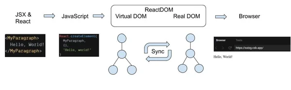

Have you always wondered why you needed two separate packages, namely **React** and **ReactDOM** to code your **web** application in React?

If so, then you are in the right place. In this blog-post we'll break the ice between those two libraries, and expose how they interact together.

The purpose of this article **is not** to dive deep into the internals of the whole React eco-system, but to expose the **big picture**, and show, from a _high-level_ point of view, how things are connected in React.

> **Disclaimer**: the views of this article are my own, and are the fruits of several years working with React and reading documentation and articles. Do not hesitate to let me know if some details are not accurate.

## React

React.js and its public API is just the **tip of the iceberg** that the whole React eco-system is.

This API enables you to create declarative views, and connect them to states, rich data and complex behaviors.

However, the API might seem a bit verbose at first glance, and that's the reason why React is usually used within [JSX](https://en.reactjs.org/docs/introducing-jsx.html). This is the API React developers use most of the time when coding the UIs.

Basically, JSX is just syntaxic sugar, to take leverage of the declarativity React offers. Note that you can perfectly use React without JSX, and create the UI views using their API to [create elements](https://en.reactjs.org/docs/react-api.html#creating-react-elements).

That encapsulation is the **highest-level API** of React, and is focused on the **developer experience**.

Deep inside this opaque API, every element you create is bound to a [Fiber](https://blog.logrocket.com/deep-dive-into-react-fiber-internals/) node, which is the internal data structure of React. However, we won't go into the details here, since this is a different topic.

## ReactDOM

Here's a (very) short definition: **ReactDOM** is the part that translates your **React** components into the **HTML** elements in the DOM of your page.

Most of the time you will use **React**, and not **ReactDOM** directly, except where you need to render you whole React application, using `ReactDOM.render()` for example.

However, ReactDOM does quite a lot of things behind the scenes, as you might have guessed.

For example, among other things, it handles the **rendering tree**, **the stack reconciler** and the **lifecycle management**. A part of this is managed using Fiber, and if you want to know more about what algorithms are behind it, I highly recommand viewing this excellent Smooshcast video featuring [Dan Abramov](https://twitter.com/dan_abramov): https://www.youtube.com/watch?v=aS41Y_eyNrU.

ReactDOM is focused on [Reactivity](https://en.wikipedia.org/wiki/Reactive_programming), and one of its main jobs is to create and update the [Virtual Dom](https://en.reactjs.org/docs/faq-internals.html), which is, as the name suggests it, the virtual **DOM** representation of your React components tree.

This allows React to perform operations on the future DOM without impacting and slowing down the current DOM in the page, and to prepare the next _frame_. This technique is quite similar to the [Multiple buffering](https://en.wikipedia.org/wiki/Multiple_buffering).

Once the next Virtual DOM is ready to be displayed on screen, ReactDOM will translate it into the **real** DOM of your browser, and your UI will be updated.

> This is a very simplified view of how ReactDOM works, and if you want to deep dive into its internals, you will find many interesting talks on YouTube about it. You can also check out the [useful links](#useful-links) section.

## A simplified but clear example

Let's see what happens in the chain processed by the React eco-system, from the `JSX` template to the final DOM of the page. This model is ultra-simplified, as we only want to get the big picture. Please keep in mind that there are **tons** of stuff happening under the opaque functions of each step.

Let's take the following React component:

```jsx
const MyParagraph = ({ children }) => <p className="MyParagraph">{children}</p>
```

It simply renders a `<p>` HTML element and the content you pass to it via `children`, with a `"MyParagraph"` className used to style it.

For the sake of the example, our App is quite simple, and this is what it renders, in **JSX**:

```jsx
const App = () => {
  return <MyParagraph>Hello, world!</MyParagraph>
}

ReactDOM.render(<App />, document.getElementById('root'))
```

Since we used JSX, it will be compiled into the following **React** code:

```jsx
var MyParagraph = function (_ref) {
  return React.createElement('p', { className: 'MyParagraph' }, 'Hello, world!', _ref.children)
}

var App = function () {
  return React.createElement(MyParagraph, {}, 'Hello, world!')
}

ReactDOM.render(React.createElement(App, null), document.getElementById('root'))
```

This is when and where **ReactDOM** intervene. As said previously, it is the _bridge_ between your **React** code and the final **DOM** in the browser. It will create an abstract model, the **virtual DOM**, and then translate it into the "final" DOM in your browser.

It will create, update and remove the **nodes** recursively. In our example, ReactDOM will create our `<MyParagraph>` React component as a `<p>` element using native JavaScript:

```jsx
var myParagraph = document.createElement('p')
myParagraph.textContent = 'Hello, world!'
// ReactDOM.render() got the container via document.getElementById('root')
container.appendChild(myParagraph)
```

Keep in mind that it is extremely more complex than that behind the scenes, because of the abstraction levels brought by Fiber and the Virtual DOM, but in the end, behind all the magic, ReactDOM is using basic JavaScript to interact with the real DOM of the browser.

## The big picture

Since a graph is worth a thousand words, here's a (very) simplified view of what happens from the JSX code of the components to what you see in the browser:



## ReactDOMServer

This is **ReactDOM**'s twin brother. Basically, its role is the same, except that it will build the final **DOM** of your page on server-side, unlike ReactDOM, that builds the DOM on client-side.

In other words, your React components tree will be built on the server, and the final DOM will be sent to the browser directly. If you want to learn more about client-side & server-side rendering, I suggest [Toptal's article](https://www.toptal.com/front-end/client-side-vs-server-side-pre-rendering), which has nice graphs that helps explaining the difference.

## ReactNative

This is another interesting topic that surely would deserve an article of its own.

As seen previously, **ReactDOM** & **ReactDOMServer** are the bridge between your React components and your **browser**.

**ReactNative** is quite different: it is the bridge between your React components and the smartphones OS, namely **Android** and **iOS**. Unlike ReactDOM that will output an HTML DOM, ReactNative will turn your React components into **native** elements, that Android & iOS can understand. The [ReactNative docs](https://reactnative.dev/docs/intro-react-native-components) page about this compilation step illustrates it very well.

## TL;DR

**React** is the tool you use to build rich, stateless, stateful and declarative views. It's the tool you use most of the time when building your UIs.

**ReactDOM** is the tool that creates an optimized virtual representation of your React components tree, and that turns it into the final HTML **DOM** in your browser.
This tool mostly does stuff behind the scenes, and you usually only use it to create an entry point between your React application and the browser's page.

## Useful links

- [Stack-overflow](https://stackoverflow.com/questions/34114350/react-vs-reactdom)
- [React docs](https://en.reactjs.org/docs/faq-internals.html)
- [ReactNative](https://reactnative.dev/)
- [React github](https://github.com/facebook/react/blob/master/packages/): the source code is really complex, but is very interesting as it helps to see what happens behind the scenes.
