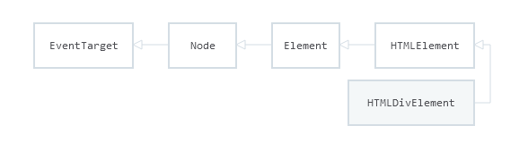

There was a time I used to struggle when manipulating the `refs` in my react components.

Sometimes they returned `undefined`, sometimes they didn't return the **DOM element** I was looking for. To be honest, I didn't know _anything_ about what I was doing. I was a total noob. I used to try any combination possible until my `ref` looked like what I wanted to get in the begining.

And even then, I had no clue on how to use the `ref` properly.

You probably already are familiar with `refs` handling in React. But if you are not, I have good hopes this article will help you a lot.

**tl;dr**: You can go directly to [this part](#react.forwardref) to read the answer if you already are **very** familiar with `refs`. However, I recommend to read from the beginning - so you can keep the best part of the cake for the end 😉

## You said ref?

First things first. What is a `ref` in React ?

It is very important to understand that a `ref` can be **two** distinct entities:

- a **React component**
- a **DOM element** (like a `<div>`)

In both cases, the `ref` is a **node** and has a `type` - it is an `instance` of a JavaScript **Class** with _methods_ & _properties_. We will go through the details in the next section.

`refs` allow you to manipulate an element outside of the [React's lifecycle flow](https://reactjs.org/docs/state-and-lifecycle.html), and to access some of its properties & methods.

> **Note**: While it is [discouraged](https://reactjs.org/docs/refs-and-the-dom.html) to overuse the `refs`, it can sometimes provide an efficient solution to a complex UI problem.

## The hidden truth

I swear to tell the _truth_, and only the _truth_.


Now we know that `refs` are not just random objects, let's dive into the depth of its implementation.

### When a `ref` is attached to a DOM element

Before we go through examples, let's define clearly what is the **instanced class** of a `ref` that was attached to a DOM element.

All DOM elements follow this architecture:



A DOM element:

- implements the interface of its tag. For example, a `<div>` implements the interface [HTMLDivElement](https://developer.mozilla.org/en/docs/Web/API/HTMLDivElement)
- implements the interface [HTMLElement](https://developer.mozilla.org/en/docs/Web/API/HTMLElement)
- is an instance of the class [Element](https://developer.mozilla.org/en/docs/Web/API/Element)

This simply means that the `ref` you attach to a DOM element like a `<div>` will be an object that inherits all the _properties_ & _methods_ the class and the interfaces offer. That said, you will be able, for example, to access the different _properties_ of your DOM element's **width** from the `ref` (like `clientWidth`, `offsetWidth` and so on).

Also, React will add some hidden _properties_ & _methods_ to the `ref` object. But these are treated like **private** stuff - you don't need to use those or even know their existence.

Depending on the browser (for example some properties & methods are not available in our worst nightmare - yes, I'm talking about IE 😵), your `ref` will look a bit like that:

```js
// the content of a ref attached to a <div>

{
  "__reactEventHandlers$q0kumw04tr": Object { children: (4) […], … },
  "__reactInternalInstance$q0kumw04tr": Object { tag: 5, elementType: "div", type: "div", … },
  accessKey: "",
  accessKeyLabel: "",
  align: "",
  assignedSlot: null,
  attributes: NamedNodeMap [],
  childElementCount: 4,
  childNodes: NodeList(4) [ div, div, h1, … ],
  children: HTMLCollection(4) [ div, div, h1, … ],
  classList: DOMTokenList [],
  className: "",
  clientHeight: 160,
  clientLeft: 0,
  clientTop: 0,
  clientWidth: 77,
  ...
  ...
  and many more stuff!
}
```

### When a `ref` is attached to a React component

There might be some edge cases (_very rare_) where you might want to attach a `ref` to a React component.

`refs` cannot be attached to **functional components** as is - it requires to use the `React.forwardRef` HOC we'll see in details later. After all, this is what this article is about!

Functional components, or stateless components, cannot have a `ref` attached because there is no state to attach the `ref` to. It as simple as that. Like said previously, the hooks solve this problem since **react@^16.8.0**.

However, you can attach a `ref` to a **Class Component**.

In this case, your `ref`:

- is an instance of your Class Component
- extends the class [React.Component](https://en.reactjs.org/docs/react-component.html)

That said, you will have access to the `state`, the `props` and the `context` of the component your `ref` was attached to.

Your `ref` will look like that:

```js
// the content of the ref you attached to your React component

{
  _reactInternalFiber: Object { tag: 1, key: null, index: 0, … },
  _reactInternalInstance: Object { … },
  context: Object {  },
  props: Object { … },
  refs: Object {  },
  state: null,
  updater: Object { isMounted: isMounted(component), enqueueSetState: enqueueSetState(...),
  ...
  ...
  And some more stuff!
}
```

Just like for the DOM element, React will add some private _properties_ & _methods_ in the `ref` - that's for the internal usage of React. You will never need to access those.


Alright, enough with the theory. Now you know exactly what you are handling, let's see how to use React's refs API! 🤘

## Creating the ref

There are actually **two** methods in order to create a `ref`. In both case, the method returns an object that will always have the following structure:

```js
// content of your ref
{
  current: HTMLElement | React.Component | undefined
}
```

So you will be able to access your targeted **node** (React or DOM) via `ref.current`

Creating a `ref` couldn't be more straight-forward - if you are in a **class component**, you can use the [React.createRef](https://reactjs.org/docs/react-api.html#reactcreateref) method.

A good practice is to create the `ref` in your `constructor`:

```jsx
class YourComponent extends React.Component {
  constructor(props) {
    super(props)
    this.ref = React.createRef()
  }
}
```

Inside a **functional component**, you can use the [React.useRef](https://reactjs.org/docs/hooks-reference.html#useref) hook. Here's how to use it:

```jsx
const YourComponent = () => {
  const ref = React.useRef()
}
```

Now your `ref` is initialized and ready to be attached to a React **class component** or a **DOM element**. Let's see how to use it.

## Using the ref

Once initialized, your `ref` needs to be attached to something. If you want to attach it to a React **class component**:

```jsx
class DummyComponent extends React.Component {
  render() {
    return <p>I am a dummy component</p>
  }
}

class YourComponent extends React.Component {
  constructor(props) {
    super(props)
    this.ref = React.createRef() // mutable object
  }

  componentDidMount() {
    // reactNode: DummyComponent
    const reactNode = this.ref.current
  }

  render() {
    return <DummyComponent ref={this.ref} />
  }
}
```

If you want to attach it to a **DOM element**:

```jsx
// You could use a class component as well.

const YourComponent = () => {
  const ref = React.useRef() // mutable object

  React.useEffect(() => {
    // divNode: HTMLDivElement
    const divNode = ref.current
  }, [])

  return <div ref={ref}>I am a div</div>
}
```

## React.forwardRef

Finaly getting there. If you read the previous part (which I trust you to have done 🙂) you may wonder what is [React.forwardRef](https://reactjs.org/docs/react-api.html#reactforwardref) there for ? After all, it seems at first glance that we got all we need already.

Well, not quite so. We are missing one problem: what if you want the `ref` you attached to a **React component** to go to the first **DOM element** it renders ? You cannot. As seen previously, the `ref` you attach to a **React component** will return the instance of this very component.

Fortunately for us, React thought about this and offers us a simple solution: **React.forwardRef**.

> **Note**: It is an [HOC](https://en.reactjs.org/docs/higher-order-components.html). So, in brief, it's a function that takes a **React component** as parameter, and also returns a **React component**.

It looks like:

```jsx
// returns a React component
React.forwardRef((props, ref) => <YourComponent forwardedRef={ref} {...props} />)
```

It sole purpose is to inform your **React component** to pass down the `ref` you attached to it down to its `props` instead of itself. So you can pass it to the **DOM element** of your chosing in its render.

Here's how to use it:

```jsx
const DummyComponent = React.forwardRef((props, ref) => {
  const { children } = props
  return <div ref={ref}>{children}</div>
})

const YourComponent = () => {
  const ref = React.useRef()

  React.useEffect(() => {
    // divNode: HTMLDivElement
    const divNode = ref.current
  }, [])

  return <DummyComponent ref={ref}>I am a dummy div</DummyComponent>
}
```

> In the above example, `divNode` is of type `HTMLDivElement` and it contains the _"I am a dummy div"_ text.

## Bonus: sharing forwarded and local refs

There are cases where you might need, at the same time, to have a local ref and also
to forward this local ref to the component's parent.

This can happen for exemple when you are implementating an _input-like_ component, and need to access the `HTMLInputElement`'s `ref` locally but also to forward it to the parent.

Here's the secret: [React.useImperativeHandle](https://en.reactjs.org/docs/hooks-reference.html#useimperativehandle)! 🤐

This method will enable you to expose the local `ref` to the parent, while keeping the same
source of truth.

You can use it this way:

```jsx
React.useImperativeHandle(forwardedRef, () => localRef.current)
```

Here's a more tangible example:

```jsx
const MyInput = React.forwardRef((props, ref) => {
  const localRef = React.useRef()
  React.useImperativeHandle(ref, () => localRef.current)
  return <input ref={localRef} />
})

const YourComponent = () => {
  const ref = React.useRef()

  React.useEffect(() => {
    const inputNode = ref.current
  }, [])

  return <MyInput ref={ref} />
}
```

Now you are able to handle the input's `ref` in both the parent and child components!

> **Note**: `inputNode` and `localRef` share the same reference.

## Conclusion

I really hope I made the whole `ref` party much more clear to you now, and that you can't wait to try out the bonus example! 😉

`refs` system can be quite difficult to understand at first (at least it was my case), but once
you know what is the type of the elements your are handling and how the `refs` work behind the scene, you realize that it's quite fun in the end.

While React offers us these tools, they strongly **discourage us** from over-using them because their **imperative pattern** goes against the asynchronous pattern of React's components lifecycle.

However there are some UI problems that cannot be solved simply: `refs` can come handy in those situations.

If you have a question, a remark, or want to bark how crap you found this article, don't hesitate to dm me on Twitter! You will find the link below.

Thanks for reading! 😃

## Useful links

What you can read for further reading:

- [React docs](https://en.reactjs.org/docs/refs-and-the-dom.html)
- [Components-extra's CreditCardNumber](https://components-extra.netlify.com/components/credit-card-number): it implements the bonus technique.
- [Ankit Singh's post on Hackernoon](https://hackernoon.com/refs-in-react-all-you-need-to-know-fb9c9e2aeb81)
