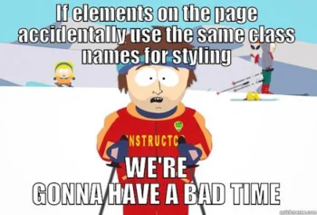

Are you somehow a little bit confused with the way [styled-components](https://styled-components.com/) turns a StyledComponent like:

```jsx
const Button = styled.button`
  background: transparent;
  padding: 0.25em 1em;
`
```

into the HTML element `<button className="sc-some-hash some-other-hash">` you see in your page ?

Perhaps you also wonder how to take leverage of styled-components to style your ReactComponent? Or maybe how to make your ReactComponent selectable from a parent component to apply styles on it like this:

```jsx
import MyCompo from './MyCompo'

// Convenient, right ? ;)
const Container = styled.div`
  ${MyCompo} {
    color: red;
  }
`
```

If so, you are in the right place. I will try to bring you some lights over those questions in this article. A hint: it's all about **classNames**!

## Some background first

Let's go through a quick introduction of styled-components first. I promise the interesting part comes very soon after 😉.

styled-components is a JavaScript (🥰) open-source library that helps you **style** your UI. Basically, it's a [CSS-in-JS](https://en.reactjs.org/docs/faq-styling.html#what-is-css-in-js) solution.

When using native **CSS** and its extensions, like **SASS** and **LESS** (that's usually the default approach when we learn web development), you implement your styles in `.css` files (or `.less|.scss`) using, for example, selectors like the HTML `<tags>`, the `classNames` & `ids`, and you can use [css variables](https://developer.mozilla.org/en-US/docs/Web/CSS/Using_CSS_custom_properties) or SASS/LESS variables. This approach has one limitation in particular: your whole theming system is hardly dynamic on runtime.

CSS-in-JS is different, and provides a solution to this problem (among others): all your styles are implemented in `.js` files, using JavaScript. This means you can **fully take leverage of the whole JavaScript eco-system** to build and handle your styles.

There are multiple css-in-jss libraries out there like [emotion](https://github.com/emotion-js/emotion), [jss](https://cssinjs.org/?v=v10.3.0) and our [styled-components](https://styled-components.com/) one. Their implementation differs: some offer the features of ES6 with its tagged template litterals, other prefer to use JS objects.

The web witnesses many [debates](https://www.reddit.com/r/reactjs/comments/ekh9p9/what_do_you_think_about_plan_css_vs_css_modules/) regarding the _pros_ & _cons_ of css-in-js, but this is not the topic of this article. Just like any solutions out there, it always depends on your context and your needs. I personally love css-in-js for the dynamic theming system and the scoping it offers. But I also don't like it because it causes some trouble for SSR front-ends. It's kind of a love-hate relationship.

## From styled-component to HTML element

So, let's go back into business. What happens between the moment you implement your **styled-component** (like the one in the introduction) and the moment it becomes an **HTML element** in the DOM of your page ?

Well, first of all, it's probably worth to mention that you can add styles using [styled()](https://styled-components.com/docs/api#styled) function on HTML elements like a `h1`, on a `StyledComponent` (like our `<Button>` example above), and on a `ReactComponent`.

In any case, the idea behind is the same. Let's take the following StyledComponent:

```jsx
const Title = styled.h1`
  color: darkcyan;
  padding: 24px;
`
```

When your code will be compiled by your favourite bundler (webpack, rollup, and others), multiple things happen, depending on if you compile in **development** or **production** mode.

### How classNames are created

**React** & **ReactDOM** will handle the rendering of your component into an HTML element, as usual. I will not go into the details of this process here, but if you're interested you can check out [the article](/how-react-and-reactdom-interact-together) I wrote about it.

**Styled-components** will handle all the styling steps. First, it will create **2 classNames** for your component.

To avoid any possible className collision, styled-components makes sure to create **unique** classNames with an **hash** of 6 characters composed of letters that are case-sensitive.

`24,794,911,296`

That's the number of different classNames you can have in your page. That said, any possible collision is really not likely to happen.
And this is just the default behavior. You can use [babel's plugin](https://github.com/styled-components/babel-plugin-styled-components) to enhance the way classNames
are generated - for example they will include some context like the name of the component.



So, why 2 classNames ?

The **first className** will usually look like `sc-hash`. This className is mainly used to **indentify** the component. No style will be directly bound to it. It acts a bit like the `id` attribute. With this first className, styled-components will be able to target easily the component and handle hierarchy around it. It will also enable it to add styles to the component when used as a selector in a parent.

The **second className** is the one that is bound to the style you wrote in your component.

What about **caching** ? Well, styled-components thought about it too! Those classNames will not change from a compilation to another, except if the styles bound to it have changed.

Please note you might need to add a [plugin](https://github.com/styled-components/babel-plugin-styled-components) to your bundler to make sure styled-components handle this step correctly.

Here's one possible render of our `<Title>`:

```html
<h1 class="sc-AxhCb kmIZff">No Code, No Bug</h1>
```

### How styles land in the DOM

This step differs from `development` mode to `production` mode.

In **development** mode, styled-components will inject a `<style>` tag inside the `<head>` of the page's DOM. This tag will include some `data` meta properties like the library's version used. And inside the tag, styled-components will append all the styles from your StyledComponents bound to their classNames.

It will look like:

```html
<style data-styled="active" data-styled-version="5.1.1">
  .kmIZff {
    color: darkcyan;
    padding: 24px;
  }
  .dRa-DOE {
    width: 400px;
  }
  .dRa-DOE .sc-AxjAm {
    border-radius: 6px;
  }
</style>
```

In **production** mode however, things are a bit different. Since we need to opitmize and compress stuff the most we can, the `<style>` tag injected by styled-components will still be there, but will be injected as empty:

```html
<style data-styled="active" data-styled-version="5.1.1"></style>
```

Remember that styled-components is a css-in-js solution ? Well in addition to write styles in js files, all your styles will be injected in this `<style>` tag via a **js script** compiled by your bundler on runtime.

Please note that this process might differ a little depending on the bundler you are using inside your project and its configuration.

## How to styled() any component ?

It couldn't be easier to style any component like your favourite `<Navbar>` ReactComponent. All you need to do is to pass the `className` prop down to the DOM element you want to style inside the `render` of your `<Navbar>`.

Usually the prop is passed down to the root DOM element of your component's render, but it depends on your need.

For example:

```jsx
const Navbar = ({ className, brand }) => {
  return (
    <header className={className}>
      <p>{brand}</p>
      <nav>...</nav>
    </header>
  )
}
```

## How to make a component selectable

There will be cases where you might need to apply styles on a component from its parent. This can be quite convenient to scope your styles and make your styling strategy more resilient to external rules.

In order to make your component selectable, you just have to wrap its declation around the `styled()` function. Doing so will assign a `className` to the component and make it targetable.

For example:

```jsx
const Navbar = styled(({ className }) => {
  return <header className={className}>...</header>
})``
```

## TL;DR

- Styled-components generates dynamic classNames to **identify** elements and to **style** them.
- In **development** mode, it injects a `<style>` tag in the page's `<head>` that contains all those style definitions.
- In **production** mode, it injects an empty `<style>` tag and hydrates it with the minified styles via a JavaScript script.
- To style a component, just pass down the `className` prop to any of its DOM elements.
- To make a component selectable, just wrap its declaration inside the `styled()` function.

## Conclusion

styled-components is an awesome css-in-js library that offers plenty of tools to style your UI built with React.

It has its _pros_ & _cons_, depending on your context and your needs, but it fits perfectly in the whole React eco-system.

I hope I gave you a better understanding of how styled-components work under the hood through this article. If not, or if you spotted a mistake, do not hesitate to reach me on Twitter!
